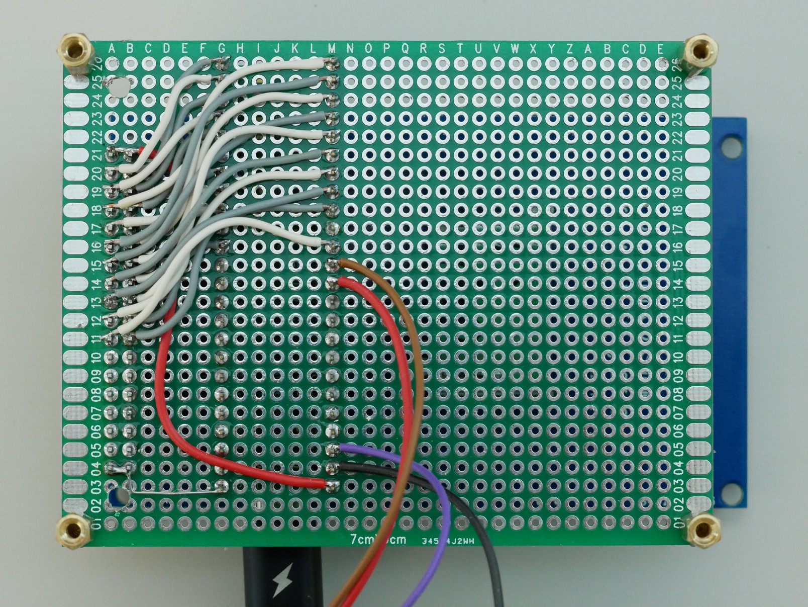
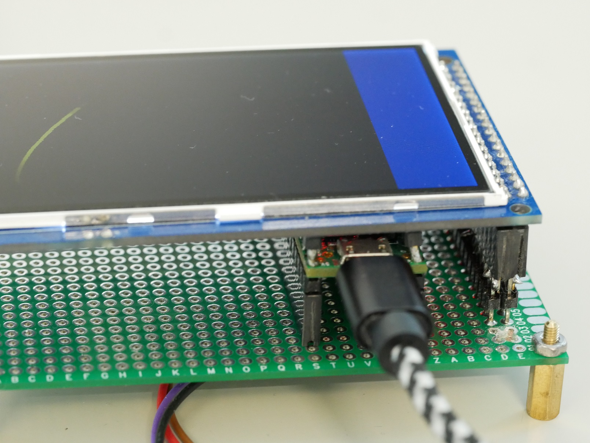

# Hardware

## Components needed

* Teensy 4.1

* a 3.5"or 3.2" TFTLCD Shield for Arduino Mega2560 with an ILI9481 or ILI9486 driver.
  Possible modules are the [3.5" LCD](https://www.tinytronics.nl/shop/en/displays/tft/3.5-inch-tft-display-320*480-pixels-mega-compatible-ili9486) or the [3.2" LCD](https://www.tinytronics.nl/shop/en/displays/tft/3.2-inch-tft-display-320*480-pixels-mega-due-compatible-ili9481) [^lcd]

[^lcd]: Only LCD modules with an ILI9481 or ILI9486 driver are supported.
  
* A [40 pin female header with 11mm pin height](https://www.tinytronics.nl/shop/en/cables-and-connectors/connectors/pin-headers/female/40-pins-header-female-11mm-pin-height) to mount the LCD above the Teensy 4.1

* A 7x9 cm prototyping PCB, some pin headers and mounting hardware.
  
## Creating the prototype PCB

See the [Schematics](TeensyScope.pdf) for details on the connections between the LCD and Teensy 4.1
I have selected all pins in a way that makes it fairly easy to hand-solder wires on a prototype PCB, leaving the unused pins as much as possible accessible for future use.

As shown here:

the only connections needed are the +5V, ground and 22 data/control wires to the LCD. The black, brown and red wires are ground and A0/A1 signals for testing. These should go to the hybrid connector on The Analog Thing.
Since I do not yet own/have tested this, thie is something to add later.
(The purple wire is the +3.3 V that I used for testing this with potentiometers)

To allow the LCD to be placed above the Teensy 4.1, use the pin headers with 11 mm long pins. If you do not have those, you will need some good soldering skills in order to create a riser as shown here:

## Connecting the scope to THAT
It should be possible to connect the analog input pins of the Teensy 4 directly to the HYB-X, Y, Z and U signals on the hybrid connector of THAT but since I have not yet tested this, you are on your own !

## ESD measures
Please note that there is no ESD protection on the Teensy board or on the oscilloscope PCB.
Take proper measures to prevent any ESD surges while handling or connecting the oscilloscope module to THAT
