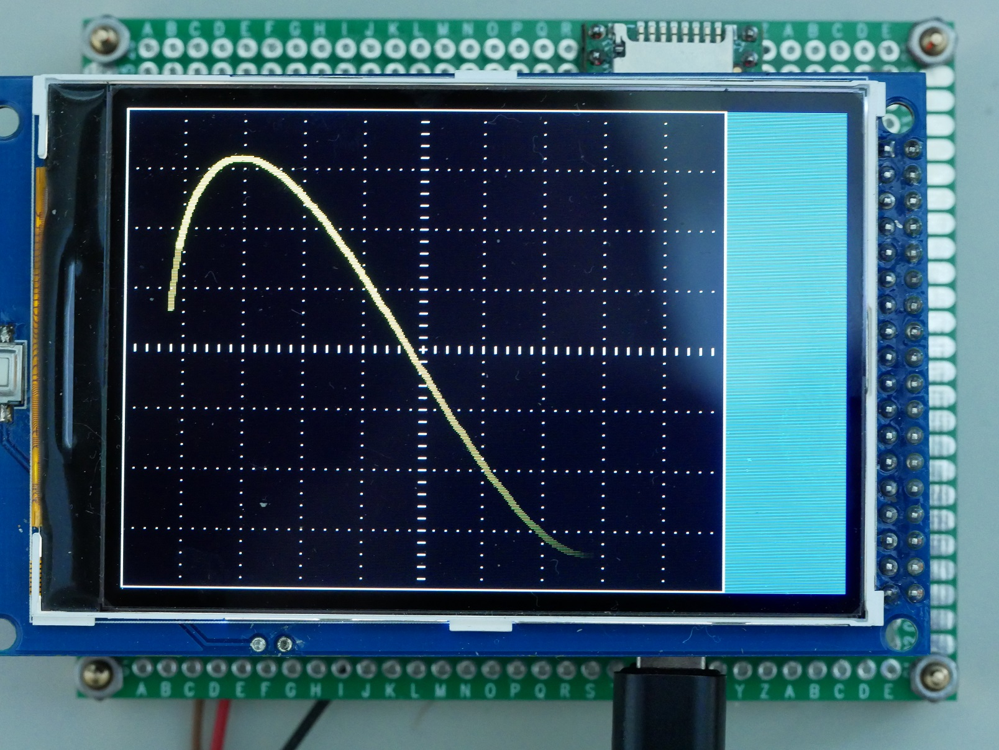

# TeensyScope
Teensy 4 oscilloscope / XY Display

A small and cheap oscilloscope style XY display based on a Teensy 4.1
and a 3.2" or 3.5" LCD module

## Current functionality
This is a very simple first try-out of an XY oscilloscope.
It mimics an analog CRT phosphor style display by increasing the intensity
depending on the speed of the 'beam' and it also fades out the tail of the
signal in a similar way as an analog scope does.

A very simple command line interface using the USB-Serial is implemented
in order to play with the parameters for the CRT simulation.
The following commands are implemented:

- ?: Print help.
- burn \<start\> \<increment\> \<max\>: Set the intensity levels of a pixel on the
        LCD. Start determines the initial intensity, increment is the value
        at which the intensity is raised when a next sample is shown at the same
        pixel and max is the maximum value of the pixel.
        The intensity goes from 0 to 255 but the max. value can be higher to
        allow for a slower decay (i.e. the pixel will be visible for a longer time)
- decay \<value\>: Determines the amount that is used to decrease the intensity of
        a pixel on the LCD. This determines how fast a pixel will fade out.
- status: shows the current values for burn and decay parameters
- reset: resets the Teensy and start again

## Hardware
A Teensy 4.1 and an LCD module are all components that are needed.
For more detailed information and schematics see the
[Hardware](Hardware) section.

## Firmware
The firmware is written in C++ using Arduino and the TeensyDuino extension.
It can be found here: [Firmware](TeensyScope)
Make sure to copy all files in a folder called TeensyScope and open the
TeensyScope.ino file in the Arduino software. 
Make sure to select the Teensy 4.1 board in the Tools -> Board menu.
The USB type should be set to "Serial" (this is the default) and
CPU Speed 600 MHz (default).

Pins 10 and 11 are used as debug pins in order to measure timing 
during development.
The current firmware (0.1.0) has a fixed 25 µs sampling interval.
Processing of one set of x,y samples takes ~ 5 µs and updating the LCD ~ 31.3 ms
This leaves ~ 20% of the available CPU time for future enhancements.

## ToDo
- [x] Add photos of prototype PCB to aid in recreating this
- [ ] Add a reticule (the grid on an oscilloscope)
- [ ] Add a timebase to be able to use this as a standard time based oscilloscope
- [ ] Add buttons/encoder as a user interface
- [ ] Add channel settings on the LCD